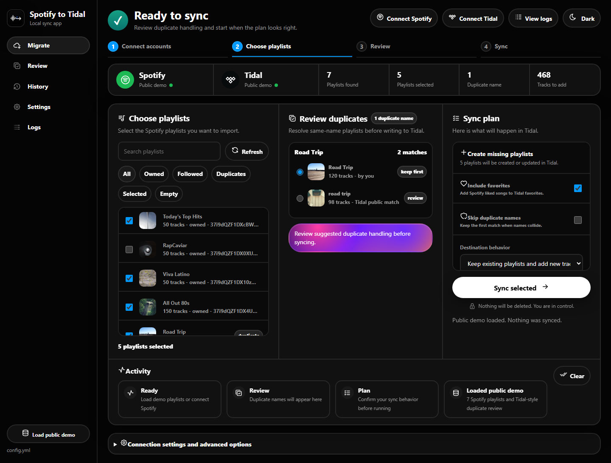
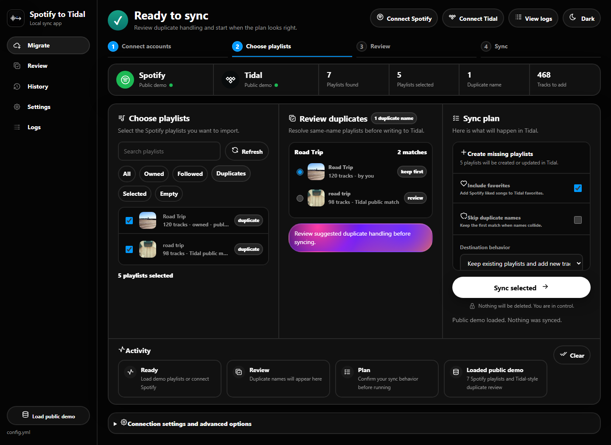
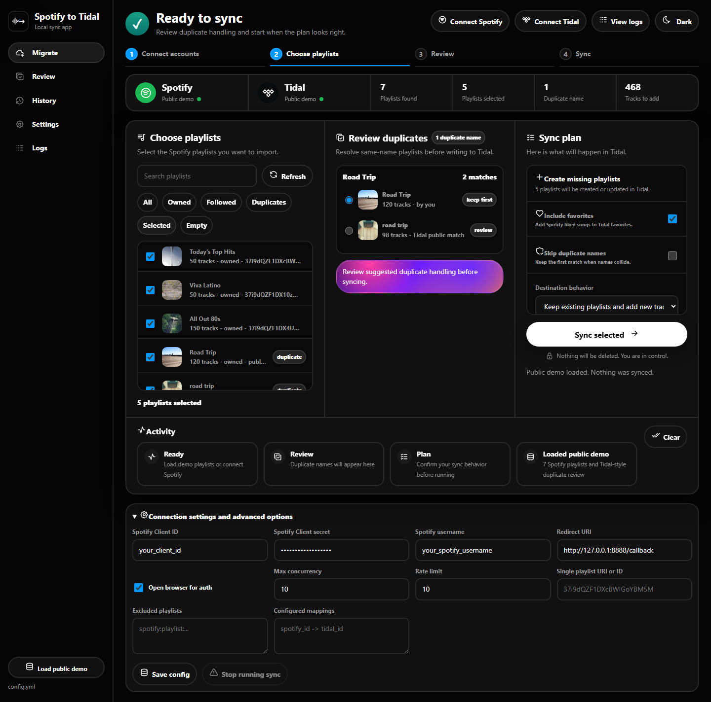
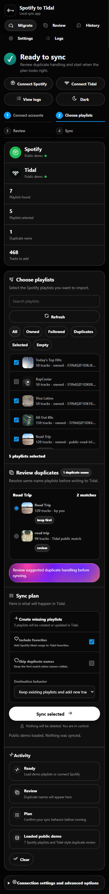

<p align="center">
  <picture>
    <source media="(prefers-color-scheme: dark)" srcset="https://shieldcn.dev/header/document.svg?title=Spotify+to+Tidal&subtitle=Move+playlists.+Review+every+match.&logo=music&theme=blue&align=center&mode=dark" />
    
  </picture>
</p>

<p align="center">
  <a href="https://github.com/gvastethecreator/spotify2tidal/actions/workflows/ci.yml"></a>
  <a href="https://gvastethecreator.github.io/spotify2tidal/"></a>
  <a href="https://www.python.org/"></a>
  <a href="#safety"></a>
  <a href="LICENSE"></a>
</p>

Local-first Python GUI and CLI for importing Spotify playlists into Tidal. It is designed for repeat synchronization of large collections, with playlist selection and duplicate-name review before a run begins.

[Project site](https://gvastethecreator.github.io/spotify2tidal/) · [Run the GUI](#run-the-gui) · [CLI reference](#use-the-cli) · [Contributing](CONTRIBUTING.md) · [Sponsor](https://github.com/sponsors/gvastethecreator) · [Ko-fi](https://ko-fi.com/gvaste)

## Product tour

These captures use the built-in public demo. No account, secret, or real playlist is shown, and the demo never starts a sync.

| Migration overview | Duplicate review |
| --- | --- |
|  |  |
| **Connection settings** | **Mobile playlist review** |
|  |  |

## What it does

- Imports all playlists, one playlist, selected playlists, or configured mappings.
- Optionally synchronizes Spotify liked songs to Tidal favorites.
- Reviews same-name playlists before writing to the destination account.
- Keeps configuration and the failed-match cache on the local machine.
- Offers both a browser-based local GUI and a scriptable CLI.

## Install

Python 3.10 or newer is required.

```bash
git clone https://github.com/gvastethecreator/spotify2tidal.git
cd spotify2tidal
python -m pip install -e .
```

## Configure

1. Copy `example_config.yml` to `config.yml`.
2. Create an app in the [Spotify Developer Dashboard](https://developer.spotify.com/dashboard).
3. Add the client ID, client secret, and Spotify username to `config.yml`.
4. Register the same `redirect_uri` from the config file in the Spotify app.
5. Keep `config.yml` private; it is ignored by Git.

See [example_config.yml](example_config.yml) for playlist filters, mappings, favorites, concurrency, and rate-limit options.

## Run the GUI

```bash
spotify_to_tidal_gui
```

Or run the module directly:

```bash
python -m spotify_to_tidal.gui
```

The GUI opens on `http://127.0.0.1:8765`. Choose **Load public demo** to inspect the complete English workflow without credentials or account writes.

## Use the CLI

Synchronize the configured collection:

```bash
spotify_to_tidal
```

Synchronize one playlist by ID or full URI:

```bash
spotify_to_tidal --uri 1ABCDEqsABCD6EaABCDa0a
```

Synchronize liked songs only:

```bash
spotify_to_tidal --sync-favorites
```

List every option:

```bash
spotify_to_tidal --help
```

## Safety

- Account secrets stay in the ignored local `config.yml` file.
- The public demo reads fixture data and does not call a sync endpoint.
- The UI states the planned destination behavior before a run.
- A running GUI sync can be stopped from the advanced settings drawer.

## Develop

The project is Python-only; `pyproject.toml` is the dependency source of truth.

```bash
python -m pip install -e .
python -m pytest
python -m compileall -q src tests
python -m pip check
```

The maintained fork adds the local GUI and its tests. The original CLI project is available at [spotify2tidal/spotify_to_tidal](https://github.com/spotify2tidal/spotify_to_tidal).

## Support

If this maintenance work is useful, you can [sponsor gvastethecreator](https://github.com/sponsors/gvastethecreator) or [support continued development on Ko-fi](https://ko-fi.com/gvaste). Bug reports and focused pull requests are welcome through [GitHub Issues](https://github.com/gvastethecreator/spotify2tidal/issues).

## License

[MIT](LICENSE)
